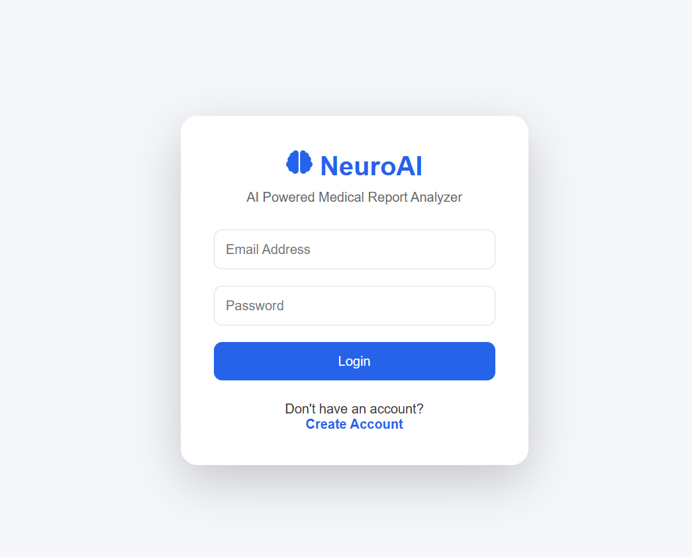
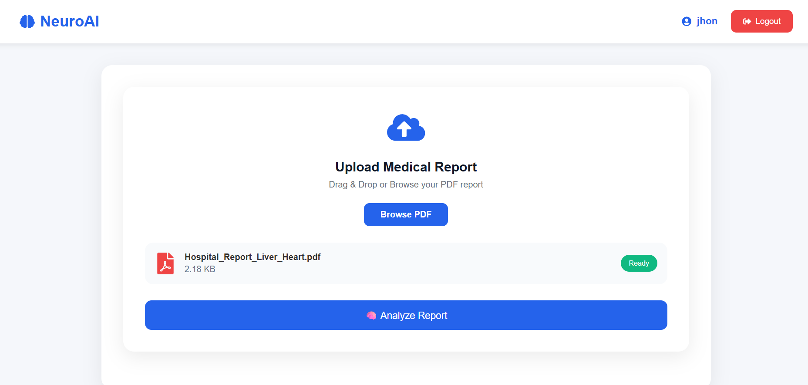
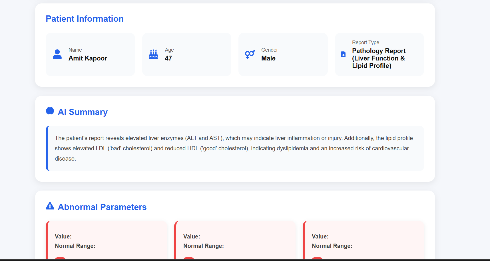

# 🧠 NeuroAI – AI Medical Report Analyzer

NeuroAI is a full-stack AI-powered web application that helps users understand complex medical reports by generating patient-friendly summaries, identifying abnormal test values, and providing personalized health recommendations using Google's Gemini AI.

The application allows users to securely upload PDF medical reports, automatically extracts medical data, analyzes laboratory parameters, and presents the results in a clean and interactive dashboard.

---

## 🚀 Live Demo

🌐 Frontend: https://neuro-ai-flame.vercel.app/login

⚙️ Backend API: https://railway.com/project/8a3abae6-7992-47f0-abf2-ccc9a9dce28c?environmentId=f00e891d-856f-447f-b7b6-ae7af4d88495

---

## 📸 Screenshots

## 📸 Login Page



---

## 📸 Signup Page


---

## 📸 Dashboard



---


### 📸 AI Analysis


---

# ✨ Features

- 🔐 Secure User Authentication (JWT)
- 👤 User Signup & Login
- 📄 Upload Medical Reports (PDF)
- 🤖 AI-powered Medical Report Analysis
- 🧠 Google Gemini AI Integration
- 🩸 Automatic Extraction of Medical Parameters
- 📊 Detects Abnormal Test Values
- 📋 Patient-friendly Summary Generation
- 💡 Personalized Health Recommendations
- 📑 Interactive Test Results Table
- 👨‍⚕️ Patient Information Extraction
- ⚡ FastAPI Backend
- ⚛️ React + Vite Frontend
- 🗄️ MySQL Database
- ☁️ Railway Backend Deployment
- 🌐 Vercel Frontend Deployment

---

# 🏗️ Tech Stack

## Frontend

- React.js
- Vite
- CSS3
- Axios
- React Icons

## Backend

- FastAPI
- Python
- SQLAlchemy
- PyMySQL
- JWT Authentication
- Google Gemini AI

## Database

- MySQL

## Deployment

- Vercel
- Railway

---

# 📂 Project Structure

```
NeuroAI
│
├── backend
│   ├── app
│   │   ├── models
│   │   ├── routers
│   │   ├── services
│   │   ├── schemas
│   │   ├── utils
│   │   ├── database.py
│   │   ├── security.py
│   │   ├── config.py
│   │   └── main.py
│   │
│   └── requirements.txt
│
├── frontend
│   ├── src
│   │   ├── components
│   │   ├── pages
│   │   ├── assets
│   │   └── App.jsx
│   │
│   ├── package.json
│   └── vite.config.js
│
└── README.md
```

---

# ⚙️ Installation

## Clone Repository

```bash
git clone https://github.com/Abhishek-22ds01/NeuroAI.git
```

```
cd NeuroAI
```

---

# Backend Setup

```
cd backend
```

Create Virtual Environment

```
python -m venv venv
```

Activate

Windows

```
venv\Scripts\activate
```

Linux/Mac

```
source venv/bin/activate
```

Install Dependencies

```
pip install -r requirements.txt
```

Create `.env`

```
MYSQL_HOST=localhost
MYSQL_PORT=3306
MYSQL_USER=root
MYSQL_PASSWORD=yourpassword
MYSQL_DATABASE=neuroai_db

SECRET_KEY=your_secret_key
ALGORITHM=HS256
ACCESS_TOKEN_EXPIRE_MINUTES=60

GEMINI_API_KEY=your_gemini_api_key
```

Run Backend

```
uvicorn app.main:app --reload
```

---

# Frontend Setup

```
cd frontend
```

Install Packages

```
npm install
```

Create `.env`

```
VITE_API_URL=http://127.0.0.1:8000
```

Run

```
npm run dev
```

---

# Production Deployment

## Backend (Railway)

Environment Variables

```
DATABASE_URL=Your Railway Database URL

GEMINI_API_KEY=Your Gemini Key

SECRET_KEY=Your Secret Key

ALGORITHM=HS256

ACCESS_TOKEN_EXPIRE_MINUTES=60
```

---

## Frontend (Vercel)

Environment Variable

```
VITE_API_URL=https://your-railway-url.up.railway.app
```

---

# Workflow

```
User
   │
   ▼
React Frontend
   │
   ▼
FastAPI Backend
   │
   ├── Authentication
   ├── PDF Extraction
   ├── Gemini AI Analysis
   └── Database
   │
   ▼
Response
   │
   ▼
Dashboard
```

---

# Sample AI Response

```json
{
  "patient_name": "Rahul Sharma",
  "age": "29 Years",
  "gender": "Male",
  "report_type": "Complete Blood Count",

  "summary": "...",

  "abnormal_parameters": [
    {
      "parameter": "Hemoglobin",
      "value": "8.6 g/dL",
      "normal_range": "13-17 g/dL",
      "status": "Low"
    }
  ],

  "recommendations": [
    "Increase iron-rich foods.",
    "Consult a physician.",
    "Repeat CBC after treatment."
  ]
}
```

---

# Future Improvements

- 📈 Report History
- 📥 Download AI Report as PDF
- 📧 Email AI Summary
- 💬 Chat with Medical Report
- 🌙 Dark Mode
- 📊 Medical Trends Dashboard
- 📱 Mobile Responsive UI
- 🌍 Multi-language Support

---

# Learning Outcomes

This project demonstrates:

- Full Stack Development
- REST API Development
- JWT Authentication
- AI Integration
- Prompt Engineering
- PDF Processing
- SQLAlchemy ORM
- Database Design
- Deployment using Railway
- Deployment using Vercel
- Environment Variable Management
- Git & GitHub Workflow

---

# Author

**Abhishek Kumar**

LinkedIn:
(Add Your LinkedIn)

GitHub:
https://github.com/Abhishek-22ds01

---

⭐ If you found this project useful, consider giving it a star.